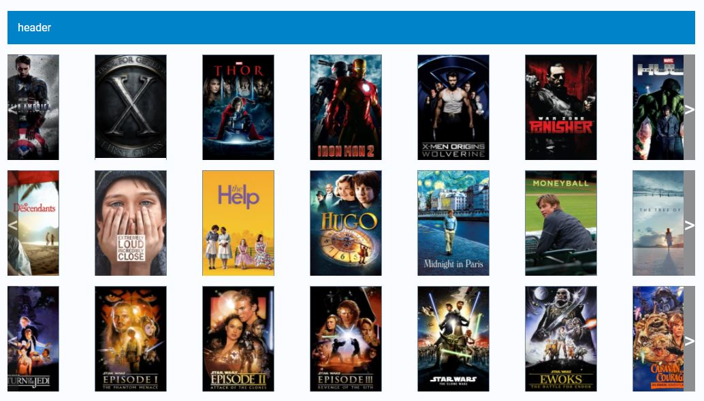
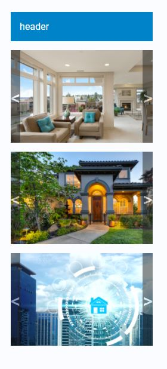
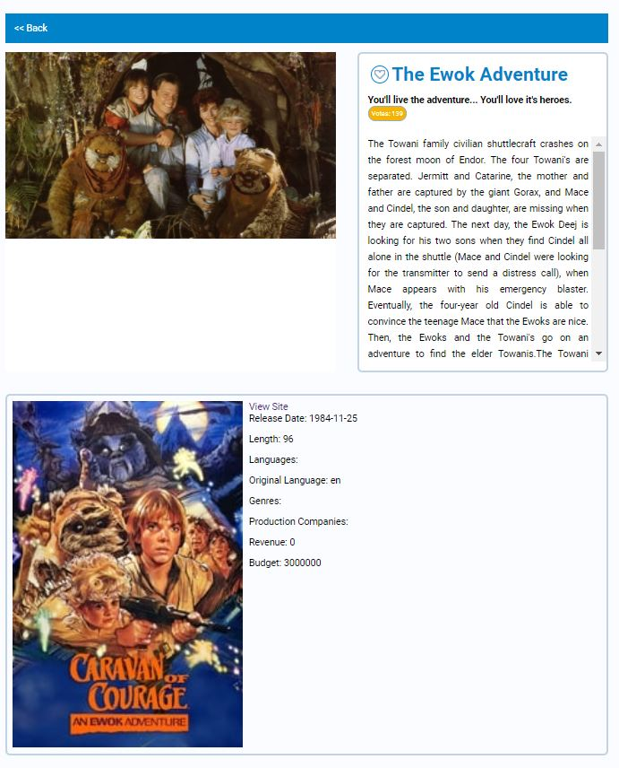
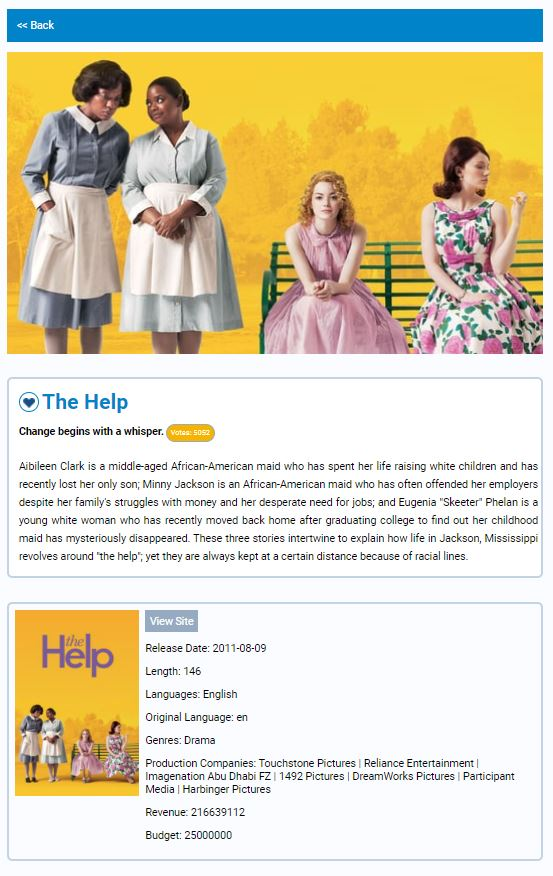
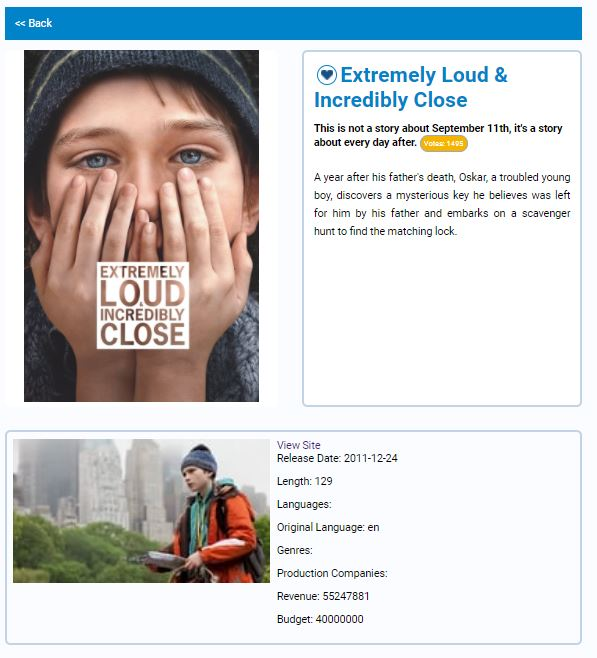
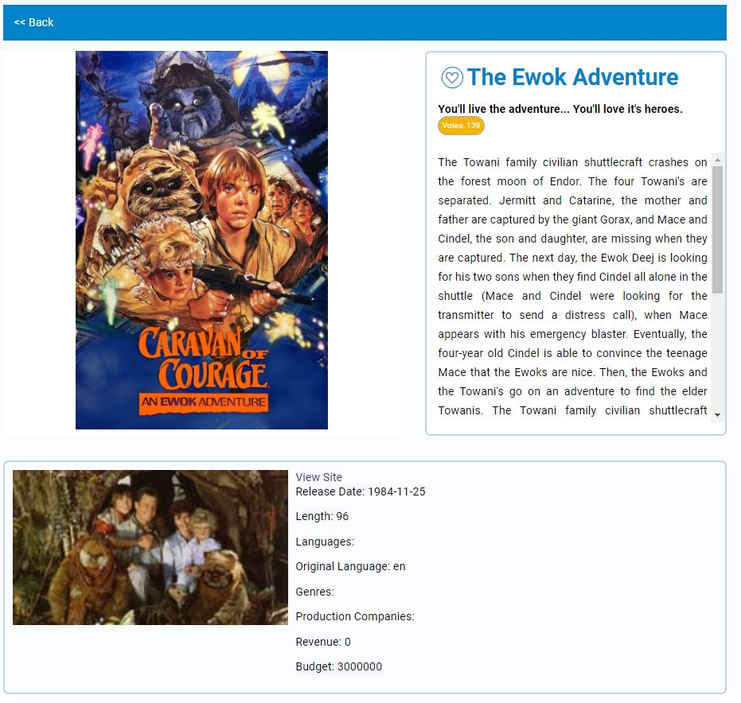
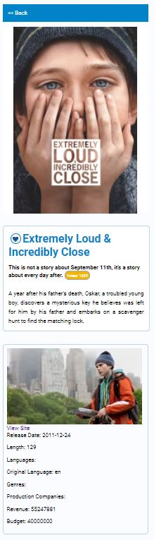
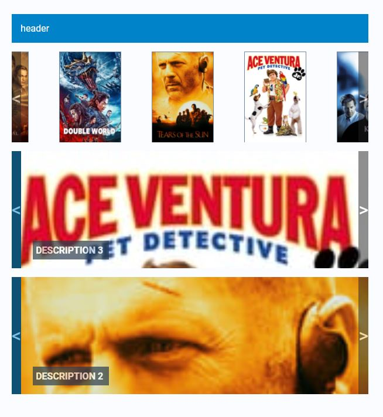
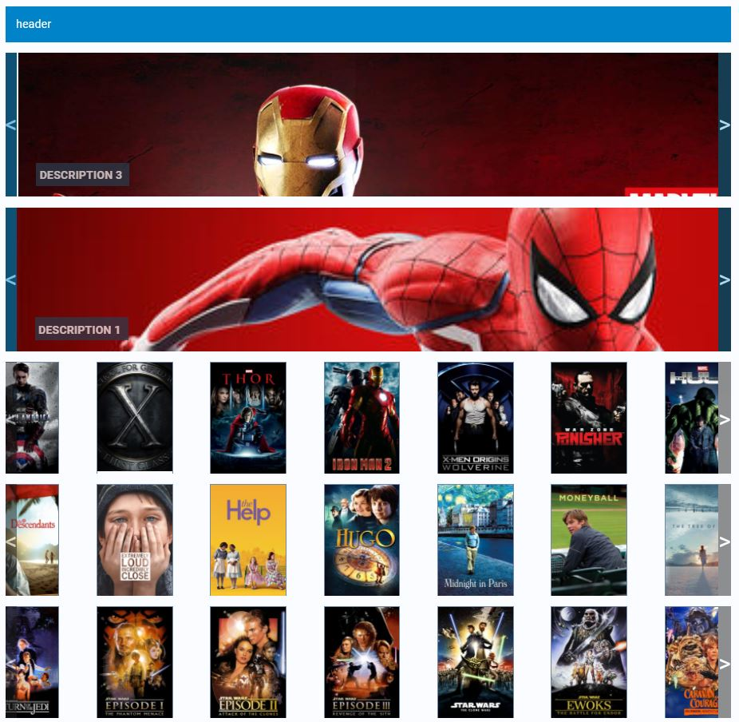
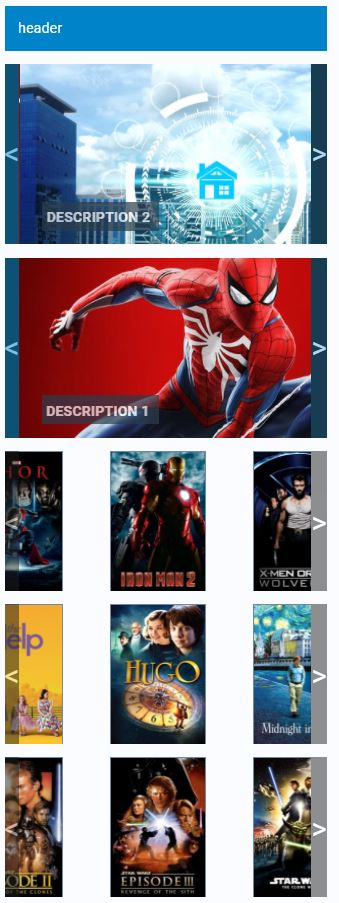

# React : RxJS, Sass, Responsive Component Architecture

React 16+ custom architecture and custom responsive components by Mark webley

You have this link because you was invited, details can be discussed when we talk.

The purpose of this is to show basic React archiecture & structural layout in code, not Graphical UI Design.

For details, call to discuss.

#### Custom Components

Includes

two custom carousels with animations:

- one banner type of carousel,

- one for product displays.

- Deliberatly prefered animation by items instead of group sets.

add to wishlist component:

- front end store

#### Styles

Also includes global sass styles

## Development server

Run

`npm i`

`npm start`

Navigate to
`http://localhost:3000/`

`http://localhost:3000/product/{id}`, eg:  `http://localhost:3000/product/167`  `http://localhost:3000/product/64685`

`http://localhost:3000/product-list`

## API Key

Uses the https://developers.themoviedb.org/ API so you will have to get your own key.

### Desktop  view

### Mobile view

### Desktop Detail view swapped poster image with backdrop image

### Mobile Detail view swapped poster image with backdrop image

### Desktop Detail view

### Desktop Detail view with scrollbar

### Mobile Detail view

### Extra views

#### Desktop  view

#### Desktop  view

#### Mobile view

